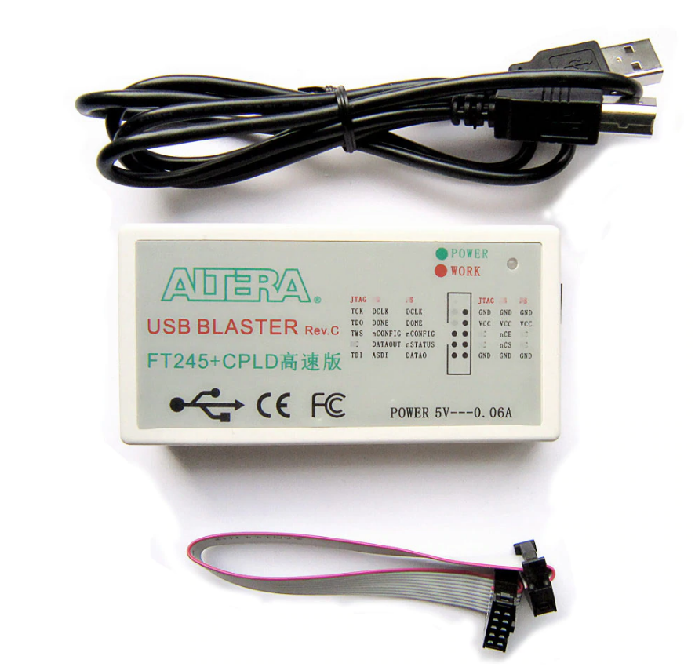

# Cisco HWIC-3G-CDMA

There is a pretty detailed reverse-engineering write-up [here](https://tomverbeure.github.io/2019/11/11/Cisco-HWIC-3G-CDMA.html).

* Mentioned on [FPGA Board Hack](https://hackaday.io/project/159853-fpga-board-hack)
* [Product Datasheet](https://manualsbrain.com/en/manuals/18492/pdf/90717e773cac1934092aa5e5747f7dc69d763a4f12ae95196a2226f8e41b79ac/cisco-hwic-3g-hspa-g-hwic-3g-hspa-g-data-sheet.pdf)

# Components

Main Components:

* Altera Cyclone II EP2C35F484C8 FPGA

    * [Cyclone II Handbook Vol 1](https://www.intel.com/content/dam/www/programmable/us/en/pdfs/literature/hb/cyc2/cyc2_cii5v1.pdf)

* Micron MT46V16M16-6T 4 Meg x 4 banks x 16 (32MB total) Automotive DDR SDRAM (2.5V, 133MHz/167MHz)

    * [Datasheet](https://www.micron.com/-/media/client/global/documents/products/data-sheet/dram/mobile-dram/low-power-dram/lpddr/256mb_x8x16_at_ddr_t66a.pdf)

* NXP ISP1564HL HS USB PCI Host Controller

    * [Datasheet](https://www.alldatasheet.com/datasheet-pdf/pdf/255353/NXP/ISP1564HL.html)
    * 3.3V power supply.
    * Built-in 1.8V regulator.

* Sierra Wireless MC5727 Wireless Module

    * [Development Manuals](https://www.manualslib.com/products/Sierra-Wireless-Airprime-Mc5727-8797020.html)
    * Controlled by host over USB
    * Can be replaced by "Mini PCI-E to USB3.0 PCI Express Adapter Card PCI-E to USB 3.0 Expansion Card", a break-out
      board connects the mini card USB to a regular USB connector.

* JTAG connector follows ALTERA USB Blaster pinout`

Various Other Components:

* ADM3222 - Analog Devices Low Power 3.3V RS-232 Line Drivers/Receivers

    * [Datasheet](https://www.analog.com/media/en/technical-documentation/data-sheets/ADM3202_3222_1385.pdf)

* AT90SC12836RCT/C9059 Crypto Chip
* Maxim MXQ3311
    * 5V/3.3V level shifters?
* Ti CU257C - SN74CBT3257C - 4-bit multiplexer/demultiplexer 5V bus switch
    * ?

Power Regulators:

* Micrel MIC49150-1.2 LDO Regulator with dual input voltages
    * [Datasheet](http://ww1.microchip.com/downloads/en/DeviceDoc/mic49150.pdf) Located between FPGA and ISP1564HL
* MIC39102 Low Voltage Regulator
    * [Datasheet](http://ww1.microchip.com/downloads/en/DeviceDoc/20005834A.pdf)
* MIC37302 Low Voltage uCap LDO Regulator (3A)
    * [Datasheet](http://ww1.microchip.com/downloads/en/DeviceDoc/MIC37300-01-02-03-3.0A-Low-Voltage-microCap-LDO-Regulator-DS20006169A.pdf)
    * EN (pin 1) is controlled by FPGA (AB17)
    * 5V input
    * 3.3V output: goes to PCI Express Mini card.

Unpopulated:

* NOR Flash

    * [Datasheet](https://www.alldatasheet.com/datasheet-pdf/pdf/211036/SPANSION/S29GL032N90TFI040.html)

# Power

All essential componets for LED blinky are connected to 3.3V. No need for 5V power rail to make that work.

12V power connector of HWIC connector is not used.

# PC Express Mini Card Info

* PC Express Mini Card: 1x PCIe + USB 2.0
    * https://en.wikipedia.org/wiki/PCI_Express#PCI_Express_Mini_Card
    * 1.5V and 3.3V.
    * 1.5V not connected? MC5727 doesn't seem to need it.

# FPGA Bitstream Configuration

There are 3 ways to program a new bitstream into the FPGA:

* JTAG

    The most obvious way is to populate connector J10 with a 10-pin 5x2 connector, use a USB Blaster
    compatible JTAG dongle, and download new bitstreams with Quartus Programmer. This will be the default mode
    during RTL development.

    The holes of connector J10 are usually soldered shut on this board. The best way to add a JTAG connector
    is to solder it solidly in the place where it was intended to be. To do that, you'll first have to open
    up these 10 soldering holes. Desoldering needles are perfect for that. They only cost a few dollars on
    AliExpress, and it requires very little practice to learn how to use them.

    There are dirt cheap USB (~$2) Blaster clones out there, but these are based on a PIC or STM microcontroller.
    These very often don't work! You can read about this [here](https://tomverbeure.github.io/2018/04/18/Terasic-vs-Cheap-Clone-USB-Blaster.html).

    What you need is a USB Blaster that contains an FTDI chip and a CPLD, just like the real one from Intel. 
    One way to make sure you get that is to simply buy an official Intel one ($200!!!), or an 'official' clone 
    from Terasic (~$50). Or you buy a clone on AliExpress that explicty mentions "FT245+CPLD", like this: 

    

    Including shipping, you can find these for less than $15, and they behave exactly like the official ones.

    When not in development mode, you *could* also download a new bitstream through JTAG by using a so-called .jam 
    file (which contains all the JTAG transactions) and a Jam file player that runs on a small microcontroller.
    This solution has not been tried on this board, but there's no reason why it wouldn't work.
    Check out [Intel's documentation](https://www.intel.com/content/www/us/en/programmable/support/support-resources/support-centers/devices/programming-tools/jam-stapl/tls-jam-embedded.html) 
    on this.

* Passive Serial

    This is the way this Cisco has been configured: an external CPU (in this case, the Cisco router that hosts
    this board), sends the bitstream to the PCB.

    Alternatively, just like with the JTAG .jam player, one could make this work with a small external
    microcontroller.

    <To be implemented>


* Active Serial

    Most FPGA board use this mode. It requires an on-board serial PROM that contains the bitstream. At
    powerup, the FPGA autonomously loads the bitstream from the PROM. No other active component are required.
    The Cisco board doesn't use this because it will always be used inside a router that has the capability to
    upload the bitstream in passive serial mode. And thus, there's no serial PROM on the board either.

    However, it is possible to retrofit the board with a serial PROM.

    

    It's obvious that this requires some soldering skills, and even then it's a pretty fragile solution.
    But it does work!


##  Active Serial Retrofit

Steps:

* Change MSEL[1:0] setting on FPGA from 2'b01 (passive serial mode) to 2'b10 (active serial)

   Remove resistor R60. This is a pullup resistor that pulls MSEL[0] to VCCIO. The FPGA has
   built-in pulldown resistors, so there is no need to add that. (It's interesting that resistor
   R59 is a pulldown resistor for MSEL[1], which is redudant...) 

* Remove SOT3-5 device that drives DCLK.

    In passive mode, DCLK is an FPGA input, now it becomes an FPGA output.

* Glue serial PROM onto the board in dead-bug position

    The best location is empty space for the unpopulated NOR flash.

    Make sure you install a 64Mbit PROM: an 8Mbit PROM is sufficient for this FPGA, but Quartus only 
    supports EPCS4 or EPC64 devices. If you mistakenly installed an 8Mbit PROM, chances are that you
    can still make it work by preparing a .jic file for a 4Mbit EPCS4 and enabling bitstream
    compression, which should reduce the bitstream size from the required 6Mbit to below 4Mbit.

* Wire up all the serial PROM pins

    Need to 

    <FIXME: comprehensive list and pictures of convenient place to tap the required signals.>

# Examples

* [Blinky](./blinky)

    The Hello World of FPGAs!

* [RS-232](./rs232)

    RS232 loopback: what gets send to UART_RXD is sent back to UART_TXD.


# FPGA Pin Connections

The pin location declaration for Quartus can be found in [./pinout.tcl](./pinout.tcl). Example projects
won't necessarily use this file, e.g. if some IP uses a different name.

FPGA Pins:

```
CLK25                   : L2
LED_GREEN_CR1           : AA19
LED_GREEN_CR3           : AB19
LED_GREEN_CR5           : AA15
LED_ORANGE_CR5          : AB15

UART_DRV_ENA_           : N6 (ADM3222/EN_) - Receiver Enable. Must be 0 to enable RX.
UART_DRV_SD_            : P6 (ADM3222/SD_) - Shutdown Control. Must be 1 to enable TX.
UART_TXD                : D6 (ADM3222/T1IN)
UART_RXD                : F4 (ADM3222/R1IN)
UART_RTS                : G6 (ADM3222/T2IN)
UART_CTS                : H6 (ADM3222/R2IN)

MSEL0                   : M17   - Pulled high with R60
MSEL1                   : N17   - Pulled low with R63
```

HWIC Pins:

23 GPIOs from FPGA on HWIC connector:

```
        1	-	    -	        35
		2	GND	    GND	        36
	70	3	G21	    GND	        37          3 == toggling output on Cisco router
		4	GND	    *  	        38
	71	5	-       GND	        39
		6	GND	    -	        40
	72	7	-	    -	        41
		8	-	    -	        42
	73	9	-	    -	        43
		10	GND	    GND	        44
	74	11	G22	    F21	        45          11 = DATA0
		12	E21	    E22	        46
	75	13	D21     D22	        47
		14	C21     C22	        48
	76	15	J22     *  	        49          49 == MXQ12 and nCONFIG_OE_
		16	*  	    N22	        50          16 == nCONFIG and MXQ12_OE_
	77	17	-	    GND	        51
		18	T22	    U21	        52
	78	19	V21	    V22	        53
		20	W21	    W22	        54
GND	79	21	Y21	    Y22	        55
		22	3.3V    N21	        56
5.0	80	23	MXQ1    -	        57
		24	GND	    MXQ2        58
GND	81	25	T21	    -	        59          25 == DCLK_OE_ / 59 == DCLK, pulled high to 3.3V
		26	*  	    *  	        60
3.3	82	27	*  	    *  	        61
		28	*  	    -           62
GND	83	29	GND	    *  	        63
		30	*  	    GND	        64
12.	84	31	GND	    *  	        65
		32	A12	    GND	        66          32: FPGA input only. Goes to clock input.
	    33	GND	    L18/MXQ7    67
		34	-   	-	        68
```

AT90SC12836RCT/C9059 connections:
```
1:      GND                         8:      5V
2:      -                           7:      Pin 13 of MXQ3311
3:      Pin 6 and 9 of MXQ3311      6:      -
4:      Pin 11 of MXQ3311           5:      Pin 8  of MXQ3311
```

AT90SC12836RCT/C9059 connections on VWIC-2MFT-T1/E1 board:
```
1:      GND                     8:      5V
2:      -                       7:      Pin 13 of MXQ3311
3:      Pin 9  of MXQ3311       6:      -
4:      Pin 11 of MXQ3311       5:      Pin 8  of MXQ3311
```

MXQ3311 connections:
```
1:      Pin 23 of HWIC         14:
2:      Pin 58 of HWIC         13: Pin 7 of C9059
3:                             12:
4:      GND                    11: Pin 4 of C9059
5:                             10: 3.3V
6:      Pin 3 of C9059          9: Pin 3 of C9059
7:      Pin 67 of HWIC/L18      8: Pin 5 of C9059
```

SDRAM to FPGA connections:
```
DQ0         : B20

DQ1         : A20
DQ2         : B19

DQ3         : A19
DQ4         : D16

DQ5         : E15
DQ6         : D15

DQ7         : C14

LDQS        : A17

LDM         : E14
WE_         : B14
CAS_        : B17
RAS_        : B18
CS_         : A5

BA0         : C17
BA1         : C18
A10/AP      : A3
A0          : A10
A1          : A9
A2          : A7
A3          : B11

DQ15        : F12

DQ14        : A15
DQ13        : B15

DQ12        : A16
DQ11        : B16

DQ10        : F13
DQ9         : F14

DQ8         : D14

UDQS        : A13

UDM         : A14

CK#         : B4
CK          : A4
CKE         : C9

A12         : D9
A11         : D11
A9          : B5
A8          : B6
A7          : B7
A6          : B8
A5          : B9
A4          : B10
```

Empty TSOP-48 (NOR flash?) footprint to FPGA:
```
pin  1 : AA17           Pin 48:  Y17
pin  2 :  W16           Pin 47: Pin 14      pulled high.
pin  3 :  V15           Pin 46: GND
pin  4 :  W15           Pin 45:  AB10
pin  5 :  V14           Pin 44:  AB8
pin  6 :  W14           Pin 43:   V9
pin  7 :  Y14           Pin 42:   W7
pin  8 : AA14           Pin 41:   W9
pin  9 :  U10           Pin 40:  AA7
pin 10 :  U13           Pin 39:  AA9
pin 11 :  Y20           Pin 38:  AB7
pin 12 :  Y13           Pin 37: VCCIO
pin 13 : NC             Pin 36:  AB9
pin 14 : Pin 47         Pin 35:   Y5
pin 15 : ???            Pin 34:   V8
pin 16 :  U9            Pin 33:   Y6
pin 17 :  U8            Pin 32:   W8
pin 18 : AB14           Pin 31:  AA6
pin 19 : AA13           Pin 30:  AA8
pin 20 : AB13           Pin 29:  AB6
pin 21 : AA12           Pin 28:  Y19
pin 22 :  V11           Pin 27: GND
pin 23 :  W11           Pin 26:  Y18
pin 24 : AA11           Pin 25: AA10
```
Important: there's at least one connection wrong in the table above. Need to revisit...

PCI USB Host to FPGA:
```
Pin  4: INTA_           :   AA5
Pin  5: RST_            :   AB18
Pin  6: SYS_TUNE        :               "Always connect to ground."
Pin  7: CLK             :   E19
Pin  8: GNT_            :   J1
Pin  9: REQ_            :   AB4
Pin 10: AD[31]          :   C1
Pin 11:
Pin 12: AD[30]          :   D2
Pin 13: AD[29]          :   D1
Pin 14: AD[28]          :   E1
Pin 15: AD[27]          :   D4
Pin 16:
Pin 17:
Pin 18:
Pin 19:
Pin 20: AD[26]          :   E4
Pin 21: AD[25]          :   E3
Pin 22: AD[24]          :   E2
Pin 23: CBE_[3]         :   Y4
Pin 24: IDSEL           :   E2          Same as AD[24]
Pin 25:

Pin 26: AD[23]          :   F3
Pin 27: AD[22]          :   F2
Pin 28: AD[21]          :   F1
Pin 29: AD[20]          :   G5
Pin 30: AD[19]          :   G3
Pin 31: AD[18]          :   H4
Pin 32:
Pin 33: AD[17]          :   H2
Pin 34: AD[16]          :   H1
Pin 35: CBE_[2]         :   Y3
Pin 36: FRAME_          :   W1
Pin 37: IRDY_           :   W2
Pin 38: TRDY_           :   W3
Pin 39: DEVSEL_         :   W4
Pin 40:
Pin 41: STOP_           :   V1
Pin 42: CLKRUN_         :               10K resistor to GNDA (pin 61)
Pin 43:
Pin 44: PERR_           :   V2
Pin 45: SERR_           :   V4
Pin 46:
Pin 47: PAR             :   U2
Pin 48: CBE_[1]         :   Y2
Pin 49:
Pin 50: AD[15]          :   J4

Pin 51: AD[14]          :   J2
Pin 52: AD[13]          :   N4
Pin 53: AD[12]          :   N3
Pin 54: AD[11]          :   N2
Pin 55:
Pin 56: AD[10]          :   N1
Pin 57: AD[9]           :   P5
Pin 58:
Pin 59: AD[8]           :   P2
Pin 60: CBE_[0]         :   Y1
Pin 61:
Pin 62: AD[7]           :   P1
Pin 63: AD[6]           :   R5
Pin 64:
Pin 65: AD[5]           :   R2
Pin 66: AD[4]           :   R1
Pin 67: AD[3]           :   T5
Pin 68: AD[2]           :   U3          Uncertain. Might be swapped with AD[3] or AD[1].
Pin 69: AD[1]           :   T3
Pin 70: AD[0]           :   T2
Pin 71:
Pin 72:
Pin 73:
Pin 74: XTAL2           :               Pulled down to GND
Pin 75: XTAL1           :               Going to FPGA with resistive divider?

Pin 76:
Pin 77:
Pin 78: OC1_N           :               Connected to OC2_N. Pulled up to VCCIO.
Pin 79: PWE1_N          :
Pin 80:
Pin 81: RREF            :
Pin 82:
Pin 83: DM1             :
Pin 84:
Pin 85: DP1             :
Pin 86:
Pin 87: OC2_N           :
Pin 88: PWE2_N          :
Pin 89:
Pin 90: DM2             :
Pin 91:
Pin 92: DP2             :
Pin 93:
Pin 94:
Pin 95:
Pin 96: SCL             :               Used for config EEPROM. Not used on this board.
Pin 97: SDA             :
Pin 98:
Pin 99: PME_            :               ?
Pin 100:
```

Miscellanous Pins:
```
AB17                    : pin 1 (EN) of MIC37302
```

# NOR Flash

The PCB has an unpopulated TSOP-48 footprint. The pads of this footprint match the requirements
for NOR flash.

*Some NAND flash also has a TSOP-48 footprint, but the pinout is not compatible. So NOR flash only.*

Pin 15 on this package is not routed to the FPGA, but its function is `RY/BY#`, the status of program or erase operation.
There are other ways for the FPGA to figure out this status, so it's not strictly needed.

Pin 47 (`BYTE#$`) is often used in these flash devices to select between 8-bit or 16-bit mode. On the
PCB, it is connected to pin 14 `wp#`). On a live board, these pins have a level of 3.3V, which is
good, because otherwise the flash would be write protected. There is an unpopulated resistor on these
pins that is connected to ground. There is no reason to populated this pin.

NOR flash:

* 256K x16 (e.g. Microchip SST39VF401C)

    * Matches. Pins 9, 10, 16 are NC on this chip.
    * Pin 47 is NC. (So no selection between 8bit or 16bit mode.

* 1M x 8bit or 256K x16 (e.g. Cypress S29AL008J)

    * Matches. Pins 9, 10, 16 are NC on this chip.
    * Pin 47 (BYTE#) selects between 8bit or 16bit mode. 3.3V -> 16bit mode only.

* 4M x8 or 2M x16 (e.g. Cypress S29J032J)

    * Matches.
    * Pin 47 (BYTE#) selects between 8bit or 16bit mode. 3.3V -> 16bit mode only.

* 8M x8 or 4M x16 (e.g. Cypress S29GL064S)

    * No Match!
    * Some models require pin 13 for bit A21, others requires pin 15 for A19. Both pin 13 and pin 15
      aren't connected to the FPGA.

Conclusion: it's possible to solder a NOR flash onto this PCB with a maximum size of 32Mbit. When
both 8bit and 16bit more are supported, the flash should be used in 16-bit mode. The pulldown
resistor should not be populated.

# Other Cisco boards with an FPGA:

* Cisco VWIC3-1MFT-T1/E1 ($4!)

    * Contains an Altera Stratix II EP2S15 (supported by Quartus Web Edition)

* Cisco VWIC3-2MFT-T1/E1 ($5!)

    * Contains an Altera Stratix II EP2S30 (NOT supported by Quartus Web Edition)
    * See https://github.com/tomverbeure/cisco-vwic3-2mft
    * See https://hackaday.io/project/159853-fpga-board-hack/log/161719-stratix-ii-cisco-vwic3-2mft)

* Cisco VWIC-2MFT-T1-DI

    * Xilinx FPGA Spartan XCS30 PQ208CKN9931

        Super old: 1368 logic cells / 1536 FFs
        https://www.ece.iastate.edu/~zambreno/classes/cpre583/documents/xilinx/ds060.pdf

    * MC68LC302 microcontroller
    * 64Kx16 SRAM
    * T1/E1 framers


